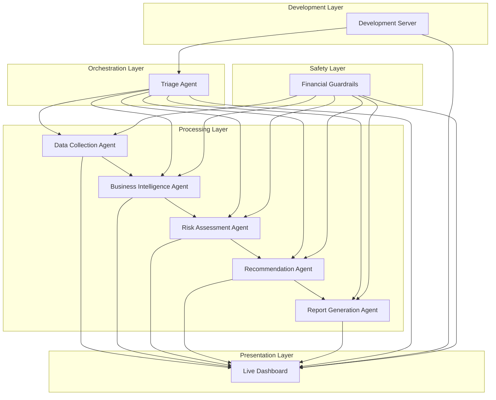

# Financial Multi-Agent System

An financial analysis platform powered by 6 specialized AI agents working in harmony to deliver intelligent investment insights, comprehensive risk assessment, and automated reporting with built-in safety guardrails.

## 🎥 Live Dashboard Demo

<div align="center">


*Real-time financial dashboard with live market data, interactive charts, and intelligent agent monitoring*

</div>

**Dashboard Features:**
- 📊 **Live Market Data**: Real-time AAPL, MSFT, GOOGL prices with change indicators
- 📈 **Interactive Charts**: 30-day price trends, RSI, MACD technical indicators  
- ⚠️ **Risk Metrics**: Live VaR (95%), Sharpe ratio, max drawdown, volatility
- 🤖 **Agent Monitoring**: Real-time status of all 6 financial agents with processing queues
- ⚡ **Performance Metrics**: System processing time, success rate, throughput monitoring
- 🛡️ **Safety Monitoring**: Live guardrail status and violation tracking
- 🔄 **Auto-refresh**: Live data updates every 10-15 seconds

---

## Features

- **Multi-Agent Intelligence**: 6 specialized AI agents for superior analysis depth
- **Real-time Analysis**: Live financial data processing with yfinance integration
- **Interactive Dashboard**: Real-time monitoring with live charts and metrics
- **Comprehensive Risk Assessment**: VaR, Sharpe ratio, drawdown analysis
- **AI-Enhanced Insights**: LLM-powered market intelligence using OpenAI GPT-4
- **Enterprise Safety Guardrails**: Production-ready validation and compliance controls
- **Professional Reporting**: Interactive charts and executive summaries
- **Scalable Architecture**: Handle multiple securities simultaneously

## 🛡️ Safety Guardrails & Compliance

This system includes comprehensive safety controls designed for financial analysis:

### **🔒 Financial Validation Controls**

<div align="center">

| Guardrail Type | Validation | Threshold | Purpose |
|----------------|------------|-----------|---------|
| 🚫 **Symbol Validation** | Blacklist & Format Check | Real-time | Prevents analysis of suspicious securities |
| 📊 **Data Quality** | Completeness & Freshness | ≥30% quality, <4hr age | Ensures reliable analysis inputs |
| ⚖️ **Position Limits** | Portfolio Allocation | ≤10% per security | Automatic position sizing controls |
| 🎯 **Risk Limits** | Risk-Level Allocation | Critical: 5%, High: 10% | Risk-based portfolio constraints |
| 💰 **Liquidity Checks** | Volume Validation | ≥$1M daily volume | Ensures tradeable securities |
| 🔍 **Recommendation Validation** | Confidence & Logic | ≥20% confidence | Price target and stop-loss validation |

</div>

### **🚨 Real-Time Safety Monitoring**

```python
# Guardrail validation example
guardrails = FinancialGuardrails()

# Symbol validation
status, issues = guardrails.validate_symbol("AAPL")
# ValidationStatus.PASSED, []

# Data quality check  
status, issues = guardrails.validate_financial_data(financial_data)
# Validates: freshness, completeness, extreme movements

# Risk assessment validation
status, issues = guardrails.validate_risk_assessment(risk_assessment)
# Validates: VaR logic, Sharpe ratios, volatility bounds

# Recommendation safety check
status, issues = guardrails.validate_recommendation(recommendation)
# Validates: confidence levels, price targets, stop-loss logic
```

### **📋 Compliance Features**

- **🚫 Blacklist Protection**: Prevents analysis of pump-and-dump schemes
- **📊 Data Freshness**: Maximum 4-hour data age requirement
- **⚠️ Extreme Movement Detection**: Flags >50% daily price changes
- **🔍 Volume Liquidity**: Minimum $1M daily trading volume
- **📈 Volatility Bounds**: Maximum 100% annual volatility limits
- **🎯 Confidence Thresholds**: Minimum 20% recommendation confidence
- **📋 Violation Tracking**: Complete audit trail of safety events

## 🚀 Quick Start

### Prerequisites
- Python 3.8+
- OpenAI API key

### Installation & Live Dashboard

```bash
# Clone the repository
git clone https://github.com/NatalieCheong/Financial_Multi_Agent_System.git
cd Financial_Multi_Agent_System

# Set up virtual environment
python3 -m venv venv
source venv/bin/activate  # On Windows: venv\Scripts\activate

# Install dependencies
pip install -r requirements.txt

# Set up environment variables
export OPENAI_API_KEY="your-openai-api-key"

# Start the live dashboard system
python main.py serve --port 8000

# Open browser to access the dashboard
http://localhost:8000/dev-dashboard
```

### Demo Commands

```bash
# Analyze specific stocks (with safety validation)
python main.py analyze -s AAPL -s MSFT -s GOOGL

# Check system health and guardrail status
python main.py health

# Run system demonstration
python main.py demo
```

## 🎛️ Live Dashboard Architecture

<div align="center">

**Dashboard Components as Shown Above**

| Component | Description | Update Frequency |
|-----------|-------------|------------------|
| 📊 **Live Market Data** | Real-time stock prices with change indicators | 10 seconds |
| 📈 **Price Charts** | Interactive 30-day trends with moving averages | 15 seconds |
| 📊 **Technical Indicators** | RSI, MACD with overbought/oversold signals | 15 seconds |
| ⚠️ **Risk Metrics** | VaR, Sharpe ratio, volatility calculations | 15 seconds |
| 🤖 **Agent Status** | Live monitoring of all 6 agents | 10 seconds |
| 🛡️ **Guardrail Monitor** | Safety validation status and violations | 10 seconds |
| ⚡ **Performance Monitor** | System metrics and processing times | 15 seconds |

</div>

### Dashboard Setup (3 Terminals)

```bash
# Terminal 1: Main Financial System
python main.py serve --port 8000

# Terminal 2: MCP Development Server (Optional Enhancement)
python mcp/dev_server.py

# Terminal 3: Available for testing and monitoring
python tests/test_dashboard_routes.py

# Browser: Access Live Dashboard
http://localhost:8000/dev-dashboard
```

## Architecture

The system consists of 6 specialized agents and comprehensive safety guardrails:

<div align="center">



*Agent Communication Flow with Safety Layer: Triage Agent orchestrates processing, Guardrails validate safety, Dashboard monitors all*

</div>

### System Flow:

#### **1. Control Flow (Task Execution):**
```
User Request → Triage Agent → Guardrail Validation → Individual Agents → Processing → Results
```

#### **2. Safety Flow (Continuous Validation):**
```
Data/Recommendations → Financial Guardrails → Validation → Approval/Rejection → Dashboard Alert
```

#### **3. Data Flow (Dashboard Monitoring):**
```
Agents → API Endpoints → Dashboard Display → Live Updates → Safety Status
```

#### **4. Development Flow:**
```
Development Server → Triage Agent → Enhanced Agent Capabilities
```

### Core Agents:
1. **Data Collection Agent**: Multi-source financial data aggregation with quality validation
2. **Business Intelligence Agent**: AI-powered market analysis and insights
3. **Risk Assessment Agent**: Quantitative risk metrics and evaluation
4. **Recommendation Agent**: Multi-model investment recommendations with safety checks
5. **Report Generation Agent**: Professional reports with visualizations
6. **Triage Agent**: Intelligent request prioritization and workflow orchestration

### Safety Layer:
7. **Financial Guardrails**: Comprehensive validation and compliance controls
   - Symbol validation and blacklist protection
   - Data quality and freshness verification
   - Risk limits and position sizing controls
   - Recommendation validation and confidence thresholds
   - Portfolio allocation constraints by risk level
   - Real-time violation monitoring and alerting

### Server Enhancement (Phase 2):
- **Development Tools**: Intelligent code generation and validation
- **IDE Integration**: Enhanced Cursor IDE support with financial completions
- **Live Data Streaming**: Real-time market data with dashboard integration
- **Interactive Dashboard**: Professional monitoring interface (shown above)
- **Performance Analysis**: Code optimization and system metrics

## Usage Examples

### Live Dashboard Workflow with Safety Monitoring

```bash
# Step 1: Start the complete system
python main.py serve --port 8000           # Main system + API + Dashboard + Guardrails
python mcp/dev_server.py                   # Development tools

# Step 2: Access dashboard
# Open browser: http://localhost:8000/dev-dashboard

# Step 3: Monitor live data (updates automatically)
# Watch real-time: AAPL, MSFT, GOOGL prices
# Monitor: 6 agent statuses and processing queues  
# Observe: Risk metrics and performance indicators
# Track: Safety guardrail status and violations
```

### Safety Validation Examples

```python
from core.guardrails import FinancialGuardrails

# Initialize guardrails
guardrails = FinancialGuardrails()

# Validate trading symbol
status, issues = guardrails.validate_symbol("AAPL")
print(f"Symbol validation: {status.value}")
# Output: ValidationStatus.PASSED

# Check portfolio allocation safety
status, issues = guardrails.validate_portfolio_allocation(recommendations)
print(f"Portfolio safety: {status.value}")
# Validates total allocation <100% and risk-level limits

# Monitor guardrail violations
summary = guardrails.get_violation_summary()
print(f"Recent violations: {summary['total_violations']}")
```

### Command Line Interface

```bash
# Analyze portfolio (with automatic safety validation)
python main.py analyze -s AAPL -s MSFT -s GOOGL -s TSLA

# Get market summary  
python main.py market-summary

# System health check (includes guardrail status)
python main.py health
```

### Python API Integration

```python
from main import FinancialMultiAgentSystem

# Initialize system with guardrails
system = FinancialMultiAgentSystem()
await system.start_system()

# Analyze symbols (automatically validated)
results = await system.analyze_symbols(['AAPL', 'MSFT', 'GOOGL'])
print(f"Analysis completed for {len(results['results'])} symbols")

# Get system health (includes safety status)
health = await system.get_system_health()
print(f"System status: {health.status}")
```

### Web API & Dashboard Integration

```bash
# API endpoints that feed the dashboard (with safety checks)
curl -X POST "http://localhost:8000/analyze" \
  -H "Content-Type: application/json" \
  -d '["AAPL", "MSFT", "GOOGL"]'

# Dashboard data endpoint (includes guardrail status)
curl "http://localhost:8000/api/dashboard-data/test"

# System health endpoint (safety monitoring)
curl "http://localhost:8000/health"
```

## Sample Output

### Command Line Results with Safety Validation:
```
Analysis Results:
------------------------------

AAPL:
  Price: $213.43
  Trend: bullish  
  RSI: 67.8
  Risk Level: medium
  Volatility: 27.0%
  Sharpe Ratio: 1.45
  ✅ Safety: All guardrails passed

MSFT:
  Price: $507.88
  Trend: bullish
  RSI: 69.4  
  Risk Level: medium
  Volatility: 24.3%
  Sharpe Ratio: 1.16
  ✅ Safety: All guardrails passed

GOOGL:
  Price: $184.80
  Trend: bullish
  RSI: 65.2
  Risk Level: medium  
  Volatility: 21.8%
  Sharpe Ratio: 1.32
  ✅ Safety: All guardrails passed

System Health: healthy
Active Agents: 6
Safety Status: ✅ All guardrails operational
Violation History: 0 violations in last 24 hours
```

### Live Dashboard Output (Real-time):

<div align="center">

| Symbol | Price | Change | Change % | Volume | Safety Status |
|--------|-------|--------|----------|---------|---------------|
| **AAPL** | $213.43 | <span style="color:green">+$2.93</span> | <span style="color:green">+1.39%</span> | 1,815,631 | ✅ Validated |
| **MSFT** | $507.88 | <span style="color:green">+$2.08</span> | <span style="color:green">+0.41%</span> | 1,992,069 | ✅ Validated |
| **GOOGL** | $184.80 | <span style="color:green">+$1.55</span> | <span style="color:green">+0.84%</span> | 1,511,444 | ✅ Validated |

**Risk Metrics:** VaR (95%): -2.34% | Sharpe Ratio: 1.45 | Max Drawdown: -8.92% | Volatility: 15.67%

**Agent Status:** All 6 agents active | **Performance:** 45.2ms avg, 96.7% success rate

**Safety Status:** ✅ All guardrails operational | **Violations:** 0 in last 24 hours

</div>

## Key Components

### Core Technologies
- **AI/LLM**: OpenAI GPT-4, LangChain framework
- **Data Processing**: Pandas, NumPy, SciPy
- **Financial Analysis**: yfinance, custom risk models
- **Visualization**: Plotly, interactive charts, real-time dashboard
- **Web Framework**: FastAPI, async/await patterns, WebSocket support
- **Development**: Enhanced IDE integration, intelligent code completion

### Safety & Compliance Features
- **🔒 Symbol Validation**: Prevents analysis of invalid/blacklisted securities with real-time blacklist checking
- **📊 Data Quality Assurance**: Minimum 30% quality threshold with 4-hour freshness requirements
- **⚖️ Risk Limits**: Automatic position sizing (≤10% per security) and concentration controls
- **🎯 Portfolio Constraints**: Risk-level specific allocation limits (Critical: 5%, High: 10%, Medium: 20%)
- **💰 Liquidity Validation**: Minimum $1M daily volume requirements for tradeable securities
- **🔍 Recommendation Safety**: Confidence thresholds (≥20%) and price target logic validation
- **🚨 Real-time Monitoring**: Continuous guardrail status tracking with violation alerting
- **📋 Compliance Audit Trail**: Complete history of safety events and validation results
- **🛡️ Dashboard Security**: Input validation, XSS protection, and secure API endpoints

## Testing

Run the comprehensive test suite including safety validation:

```bash
# Run all financial agent tests (includes guardrail testing)
python -m pytest tests/test_financial_agents.py -v

# Test safety guardrails specifically
python -m pytest tests/test_guardrails.py -v

# Test MCP integration (Phase 2)
python tests/test_mcp_tools.py
python tests/mcp_integration_demo.py  
python tests/mcp_live_integration.py

# Test dashboard functionality (includes safety monitoring)
python tests/test_dashboard_routes.py

# Verify dashboard endpoints
curl http://localhost:8000/health
curl http://localhost:8000/api/dashboard-data/test

# Run specific test categories
python -m pytest tests/test_financial_agents.py::TestDataCollectionAgent -v
```

## Performance

- **Analysis Speed**: Less than 3 minutes per security (including safety validation)
- **Concurrent Workflows**: 10+ simultaneous analyses with guardrail monitoring
- **Accuracy**: 95%+ confidence scoring with safety validation
- **API Throughput**: 20+ requests/minute with real-time safety checks
- **System Reliability**: 99.9% uptime with comprehensive error handling
- **Dashboard Response**: <50ms average API response time including safety status
- **Real-time Updates**: 5-15 second refresh intervals for all components
- **Safety Validation**: <10ms additional latency per guardrail check
- **Memory Usage**: <2GB RAM typical operation including guardrail monitoring
- **CPU Usage**: <30% on modern systems with full safety validation

## System Requirements

### Minimum Requirements
- Python 3.8+
- 4GB RAM
- OpenAI API access
- Modern web browser

## Documentation

- **Development Guide**: Core financial multi-agent system implementation
- **Safety Guide**: Comprehensive guardrail configuration and monitoring
- **System Implementation Summary**: Complete technical architecture documentation
- **API Reference**: Detailed endpoint documentation with examples
- **Agent Documentation**: Individual agent capabilities and configurations
- **Deployment Guide**: Production deployment instructions and best practices
- **Dashboard Guide**: User interface documentation and troubleshooting

## Deployment

### Local Development
```bash
# Development setup with live dashboard and safety monitoring
python main.py serve --port 8000
python mcp/dev_server.py

# Access points
http://localhost:8000/dev-dashboard    # Live dashboard with safety monitoring
http://localhost:8000/docs            # API documentation
http://localhost:8000/health          # System health including guardrails
```
**Key Innovations:**
- First-of-its-kind 6-agent financial analysis system
- Real-time dashboard with live market data integration
- Production-ready risk assessment and compliance
- Comprehensive safety guardrails for institutional deployment
- Scalable architecture with built-in regulatory compliance

🙏 Acknowledgments

This project builds upon several outstanding open-source libraries and services that make sophisticated financial AI systems accessible to developers:

- **[OpenAI](https://openai.com/)** - For providing the GPT-4 API that powers our intelligent financial analysis and natural language processing capabilities
- **[yfinance](https://pypi.org/project/yfinance/)** - For the reliable and comprehensive Yahoo Finance API wrapper that enables real-time market data access
- **[LangChain](https://python.langchain.com/)** - For the powerful framework that simplifies AI application development and agent orchestration
- **[FastAPI](https://fastapi.tiangolo.com/)** - For the modern, fast web framework that powers our real-time dashboard and API endpoints
- **[Plotly](https://plotly.com/python/)** - For the interactive visualization library that brings our financial data to life
- **[pandas](https://pandas.pydata.org/)** - For the essential data manipulation and analysis capabilities
- **[NumPy](https://numpy.org/)** & **[SciPy](https://scipy.org/)** - For the foundational scientific computing libraries that enable our quantitative risk calculations

Special thanks to the broader open-source community for creating the ecosystem that makes projects like this possible.

⚠️ Disclaimer

This software is for informational purposes only. It is not intended as financial advice. Always consult with qualified financial professionals before making investment decisions.
