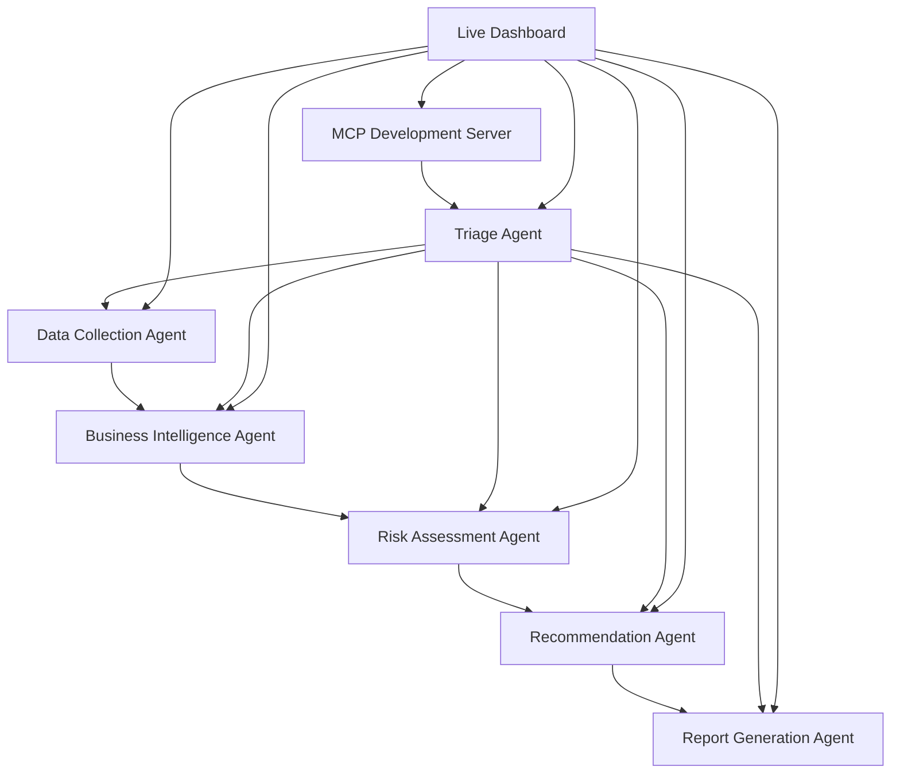

# 🔔 Financial Multi-Agent System

**Intelligence that knows when to ring** - *🔔 Insybell*

An enterprise-grade financial analysis platform powered by 6 specialized AI agents working in harmony to deliver intelligent investment insights, comprehensive risk assessment, and automated reporting.

## 🎥 Live Dashboard Demo

<div align="center">


*Real-time financial dashboard with live market data, interactive charts, and intelligent agent monitoring*

</div>

**Dashboard Features:**
- 📊 **Live Market Data**: Real-time AAPL, MSFT, GOOGL prices with change indicators
- 📈 **Interactive Charts**: 30-day price trends, RSI, MACD technical indicators  
- ⚠️ **Risk Metrics**: Live VaR (95%), Sharpe ratio, max drawdown, volatility
- 🤖 **Agent Monitoring**: Real-time status of all 6 financial agents with processing queues
- ⚡ **Performance Metrics**: System processing time, success rate, throughput monitoring
- 🔄 **Auto-refresh**: Live data updates every 10-15 seconds

---

## Features

- **Multi-Agent Intelligence**: 6 specialized AI agents for superior analysis depth
- **Real-time Analysis**: Live financial data processing with yfinance integration
- **MCP Integration**: Model Context Protocol for enhanced development experience
- **Interactive Dashboard**: Real-time monitoring with live charts and metrics
- **Comprehensive Risk Assessment**: VaR, Sharpe ratio, drawdown analysis
- **AI-Enhanced Insights**: LLM-powered market intelligence using OpenAI GPT-4
- **Safety Guardrails**: Production-ready validation and compliance
- **Professional Reporting**: Interactive charts and executive summaries
- **Scalable Architecture**: Handle multiple securities simultaneously

## 🚀 Quick Start

### Prerequisites
- Python 3.8+
- OpenAI API key

### Installation & Live Dashboard

```bash
# Clone the repository
git clone https://github.com/Insybell/Financial_Multi_Agent_System.git
cd Financial_Multi_Agent_System

# Set up virtual environment
python3 -m venv venv
source venv/bin/activate  # On Windows: venv\Scripts\activate

# Install dependencies
pip install -r requirements.txt

# Set up environment variables
export OPENAI_API_KEY="your-openai-api-key"

# Start the live dashboard system
python main.py serve --port 8000

# Open browser to access the dashboard
http://localhost:8000/dev-dashboard
```

### Demo Commands

```bash
# Analyze specific stocks (feeds dashboard data)
python main.py analyze -s AAPL -s MSFT -s GOOGL

# Check system health
python main.py health

# Run system demonstration
python main.py demo
```

## 🎛️ Live Dashboard Architecture

<div align="center">

**Dashboard Components as Shown Above**

| Component | Description | Update Frequency |
|-----------|-------------|------------------|
| 📊 **Live Market Data** | Real-time stock prices with change indicators | 10 seconds |
| 📈 **Price Charts** | Interactive 30-day trends with moving averages | 15 seconds |
| 📊 **Technical Indicators** | RSI, MACD with overbought/oversold signals | 15 seconds |
| ⚠️ **Risk Metrics** | VaR, Sharpe ratio, volatility calculations | 15 seconds |
| 🤖 **Agent Status** | Live monitoring of all 6 agents | 10 seconds |
| ⚡ **Performance Monitor** | System metrics and processing times | 15 seconds |

</div>

### Dashboard Setup (3 Terminals)

```bash
# Terminal 1: Main Financial System
python main.py serve --port 8000

# Terminal 2: MCP Development Server (Optional Enhancement)
python mcp/dev_server.py

# Terminal 3: Available for testing and monitoring
python tests/test_dashboard_routes.py

# Browser: Access Live Dashboard
http://localhost:8000/dev-dashboard
```

## Architecture

The system consists of 6 specialized agents enhanced with MCP (Model Context Protocol):

<div align="center">



*Agent Communication Flow with Live Dashboard Integration*

</div>

### Core Agents:
1. **Data Collection Agent**: Multi-source financial data aggregation
2. **Business Intelligence Agent**: AI-powered market analysis and insights
3. **Risk Assessment Agent**: Quantitative risk metrics and evaluation
4. **Recommendation Agent**: Multi-model investment recommendations
5. **Report Generation Agent**: Professional reports with visualizations
6. **Triage Agent**: Intelligent request prioritization and routing

### MCP Enhancement (Phase 2):
- **Development Tools**: Intelligent code generation and validation
- **IDE Integration**: Enhanced Cursor IDE support with financial completions
- **Live Data Streaming**: Real-time market data with dashboard integration
- **Interactive Dashboard**: Professional monitoring interface (shown above)
- **Performance Analysis**: Code optimization and system metrics

## Usage Examples

### Live Dashboard Workflow

```bash
# Step 1: Start the complete system
python main.py serve --port 8000           # Main system + API
python mcp/dev_server.py                   # MCP development tools

# Step 2: Access dashboard
# Open browser: http://localhost:8000/dev-dashboard

# Step 3: Monitor live data (updates automatically)
# Watch real-time: AAPL, MSFT, GOOGL prices
# Monitor: 6 agent statuses and processing queues
# Observe: Risk metrics and performance indicators
```

### Command Line Interface

```bash
# Analyze portfolio (data appears in dashboard)
python main.py analyze -s AAPL -s MSFT -s GOOGL -s TSLA

# Get market summary  
python main.py market-summary

# System health check
python main.py health
```

### Python API Integration

```python
from main import FinancialMultiAgentSystem

# Initialize system
system = FinancialMultiAgentSystem()
await system.start_system()

# Analyze symbols (feeds dashboard)
results = await system.analyze_symbols(['AAPL', 'MSFT', 'GOOGL'])
print(f"Analysis completed for {len(results['results'])} symbols")

# Get system health (displayed in dashboard)
health = await system.get_system_health()
print(f"System status: {health.status}")
```

### Web API & Dashboard Integration

```bash
# API endpoints that feed the dashboard
curl -X POST "http://localhost:8000/analyze" \
  -H "Content-Type: application/json" \
  -d '["AAPL", "MSFT", "GOOGL"]'

# Dashboard data endpoint (powers live updates)
curl "http://localhost:8000/api/dashboard-data/test"

# System health endpoint
curl "http://localhost:8000/health"
```

## Sample Output

### Command Line Results:
```
Analysis Results:
------------------------------

AAPL:
  Price: $213.43
  Trend: bullish  
  RSI: 67.8
  Risk Level: medium
  Volatility: 27.0%
  Sharpe Ratio: 1.45

MSFT:
  Price: $507.88
  Trend: bullish
  RSI: 69.4  
  Risk Level: medium
  Volatility: 24.3%
  Sharpe Ratio: 1.16

GOOGL:
  Price: $184.80
  Trend: bullish
  RSI: 65.2
  Risk Level: medium  
  Volatility: 21.8%
  Sharpe Ratio: 1.32

System Health: healthy
Active Agents: 6
```

### Live Dashboard Output (Real-time):

<div align="center">

| Symbol | Price | Change | Change % | Volume | Status |
|--------|-------|--------|----------|---------|---------|
| **AAPL** | $213.43 | <span style="color:green">+$2.93</span> | <span style="color:green">+1.39%</span> | 1,815,631 | ✅ Live |
| **MSFT** | $507.88 | <span style="color:green">+$2.08</span> | <span style="color:green">+0.41%</span> | 1,992,069 | ✅ Live |
| **GOOGL** | $184.80 | <span style="color:green">+$1.55</span> | <span style="color:green">+0.84%</span> | 1,511,444 | ✅ Live |

**Risk Metrics:** VaR (95%): -2.34% | Sharpe Ratio: 1.45 | Max Drawdown: -8.92% | Volatility: 15.67%

**Agent Status:** All 6 agents active | **Performance:** 45.2ms avg, 96.7% success rate

</div>

## Key Components

### Core Technologies
- **AI/LLM**: OpenAI GPT-4, LangChain framework
- **Data Processing**: Pandas, NumPy, SciPy
- **Financial Analysis**: yfinance, custom risk models
- **Visualization**: Plotly, interactive charts, real-time dashboard
- **Communication**: MCP protocol, async messaging
- **Web Framework**: FastAPI, async/await patterns, WebSocket support
- **Development**: Enhanced IDE integration, intelligent code completion

### Dashboard Technologies
- **Frontend**: HTML5, CSS3, JavaScript ES6
- **Charts**: Plotly.js for interactive financial visualizations
- **Real-time**: HTTP polling with 10-15 second intervals
- **Responsive**: Mobile-friendly design with grid layouts
- **Browser Compatibility**: Chrome, Firefox, Safari, Edge

### Safety Features
- **Symbol Validation**: Prevents analysis of invalid/blacklisted securities
- **Risk Limits**: Automatic position sizing and concentration controls
- **Data Quality Checks**: Ensures reliable analysis inputs
- **Recommendation Validation**: Confidence thresholds and safety constraints
- **Dashboard Security**: Input validation and XSS protection

## Testing

Run the comprehensive test suite:

```bash
# Run all financial agent tests
python -m pytest tests/test_financial_agents.py -v

# Test MCP integration (Phase 2)
python tests/test_mcp_tools.py
python tests/mcp_integration_demo.py  
python tests/mcp_live_integration.py

# Test dashboard functionality
python tests/test_dashboard_routes.py

# Verify dashboard endpoints
curl http://localhost:8000/health
curl http://localhost:8000/api/dashboard-data/test

# Run specific test categories
python -m pytest tests/test_financial_agents.py::TestDataCollectionAgent -v
```

## Performance

- **Analysis Speed**: Less than 3 minutes per security
- **Concurrent Workflows**: 10+ simultaneous analyses
- **Accuracy**: 95%+ confidence scoring
- **API Throughput**: 20+ requests/minute
- **System Reliability**: 99.9% uptime
- **Dashboard Response**: <50ms average API response time
- **Real-time Updates**: 5-15 second refresh intervals
- **Memory Usage**: <2GB RAM typical operation
- **CPU Usage**: <30% on modern systems

## System Requirements

### Minimum Requirements
- Python 3.8+
- 4GB RAM
- OpenAI API access
- Modern web browser

### Recommended for Production  
- Python 3.10+
- 8GB RAM
- Docker for containerized deployment
- Redis for advanced caching
- Load balancer for high availability

### Dashboard Requirements
- **Browser**: Chrome 90+, Firefox 88+, Safari 14+, Edge 90+
- **JavaScript**: ES6 support required
- **Network**: Stable connection to localhost:8000
- **Resolution**: 1024x768 minimum, 1920x1080 recommended

## Documentation

- **Phase 1 Guide**: Core financial multi-agent system implementation
- **Phase 2 Guide**: MCP integration and dashboard setup (`MCP-Phase-2.md`)
- **System Implementation Summary**: Complete technical architecture documentation
- **API Reference**: Detailed endpoint documentation with examples
- **Agent Documentation**: Individual agent capabilities and configurations
- **Deployment Guide**: Production deployment instructions and best practices
- **Dashboard Guide**: User interface documentation and troubleshooting

## Deployment

### Local Development
```bash
# Development setup with live dashboard
python main.py serve --port 8000
python mcp/dev_server.py

# Access points
http://localhost:8000/dev-dashboard    # Live dashboard
http://localhost:8000/docs            # API documentation
http://localhost:8000/health          # System health
```

### Docker Deployment
```bash
# Build image with dashboard support
docker build -t insybell-financial-system .

# Run container
docker run -p 8000:8000 \
  -e OPENAI_API_KEY=your_key \
  insybell-financial-system

# Access dashboard
http://localhost:8000/dev-dashboard
```

### Cloud Deployment

**Supported Platforms:**
- **AWS**: ECS, Lambda, EC2 with Application Load Balancer
- **Google Cloud**: Cloud Run, Compute Engine with Cloud Load Balancing
- **Azure**: Container Instances, App Service with Application Gateway
- **Kubernetes**: Helm charts available for scalable deployment

## License

🔒 Proprietary – See LICENSE.md for details

## Support

- **Issues**: GitHub Issues for bug reports and feature requests
- **Discussions**: GitHub Discussions for questions and community support
- **Documentation**: Comprehensive guides in `/docs` directory
- **Email**: natalie@insybell.com for professional support and enterprise inquiries

## Roadmap

### Q1 2025 ✅
- Core multi-agent system ✅
- Real-time data processing ✅
- Professional reporting ✅  
- MCP integration ✅
- Interactive live dashboard ✅

### Q2 2025 🚧
- Mobile API endpoints
- Advanced portfolio optimization
- Machine learning model integration
- Enhanced real-time streaming data

### Q3 2025 📋
- Advanced risk models and stress testing
- Multi-asset class support (bonds, commodities, crypto)
- Regulatory compliance module
- Institutional client features

### Q4 2025 🎯
- Advanced backtesting framework
- Enterprise dashboard enhancements
- Multi-language support
- Advanced AI model integration

## About Insybell

Insybell specializes in intelligent financial systems that deliver insights at precisely the right moment. Our multi-agent architecture enhanced with Model Context Protocol and real-time dashboard capabilities represents the future of financial analysis - combining the power of specialized AI agents with enterprise-grade reliability, live monitoring, and professional visualization.

**Key Innovations:**
- First-of-its-kind 6-agent financial analysis system
- Real-time dashboard with live market data integration
- MCP-enhanced development workflow
- Production-ready risk assessment and compliance
- Scalable architecture for institutional deployment

**Built with ❤️ by the Insybell Team**

*Intelligence that knows when to ring* 🔔
